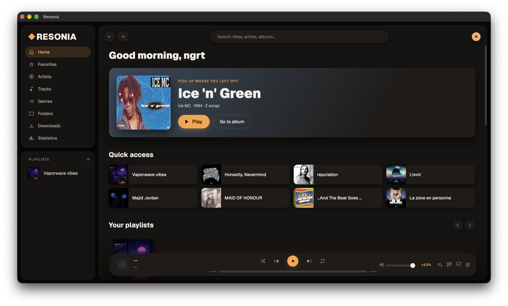
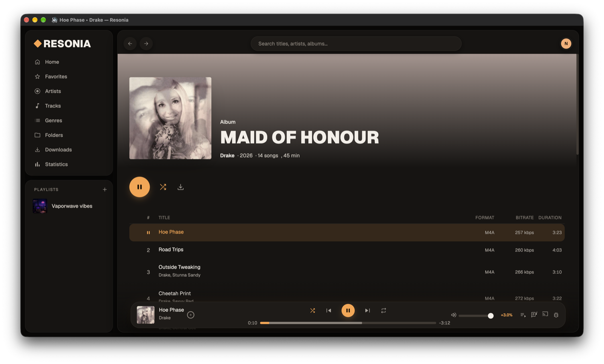
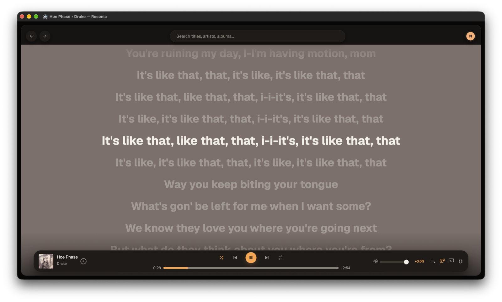
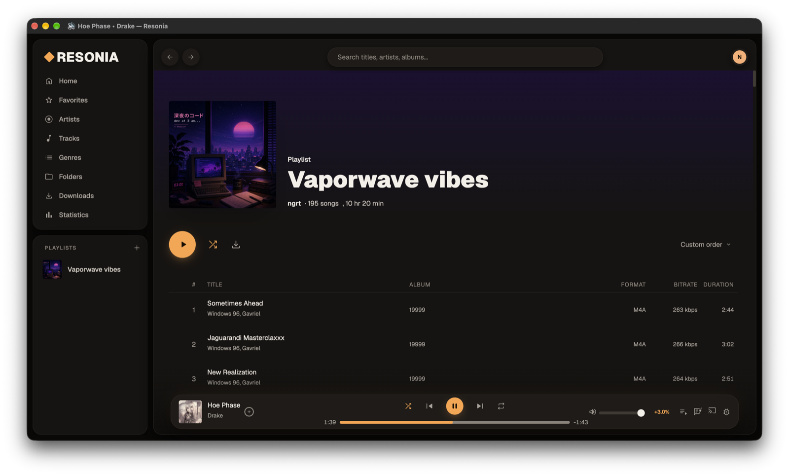

<h1 align="center" id="title">Resonia</h1>

<p id="description">A very Spotify-like and fully customisable music player for Navidrome writen in TypeScript.</p>

<p align="center"></p>

<h2>Project Screenshots:</h2>

<p align="center">
  
  
</p>
<p align="center">
  
  
</p>

  
  
<h2>🧐 Features</h2>

Here're some of the project's best features:

*   Modern interface
*   Can customize interface
*   Web player backend
*   Buffering and persistant cache for faster loading
*   Lyrics and animated covers

<h2>🛠️ Installation Steps:</h2>

<h3>💻 Desktop app</h3>

Download the build for your system (all files are also on the [Releases page](https://github.com/midnights-ra1n/resonia-client/releases)):

<!-- downloads:start -->
Latest version: **[v1.0.0-beta.5](https://github.com/midnights-ra1n/resonia-client/releases/tag/v1.0.0-beta.5)**

| OS | Download |
| --- | --- |
| macOS | [Apple Silicon (.dmg)](https://github.com/midnights-ra1n/resonia-client/releases/download/v1.0.0-beta.5/Resonia-1.0.0-beta.5-arm64.dmg)<br>[Apple Silicon (.pkg)](https://github.com/midnights-ra1n/resonia-client/releases/download/v1.0.0-beta.5/Resonia-1.0.0-beta.5-arm64.pkg) |
| Windows | [x64 / ARM64 (.exe)](https://github.com/midnights-ra1n/resonia-client/releases/download/v1.0.0-beta.5/Resonia-Setup-1.0.0-beta.5.exe) |
| Linux | [x86_64 (.AppImage)](https://github.com/midnights-ra1n/resonia-client/releases/download/v1.0.0-beta.5/Resonia-1.0.0-beta.5-x86_64.AppImage)<br>[ARM64 (.AppImage)](https://github.com/midnights-ra1n/resonia-client/releases/download/v1.0.0-beta.5/Resonia-1.0.0-beta.5-arm64.AppImage)<br>[x86_64 (.deb)](https://github.com/midnights-ra1n/resonia-client/releases/download/v1.0.0-beta.5/Resonia-1.0.0-beta.5-amd64.deb)<br>[ARM64 (.deb)](https://github.com/midnights-ra1n/resonia-client/releases/download/v1.0.0-beta.5/Resonia-1.0.0-beta.5-arm64.deb)<br>[x86_64 (.rpm)](https://github.com/midnights-ra1n/resonia-client/releases/download/v1.0.0-beta.5/Resonia-1.0.0-beta.5-x86_64.rpm)<br>[ARM64 (.rpm)](https://github.com/midnights-ra1n/resonia-client/releases/download/v1.0.0-beta.5/Resonia-1.0.0-beta.5-aarch64.rpm) |
<!-- downloads:end -->

The desktop app updates itself automatically. You can opt in to beta releases in the settings.

> [!NOTE]
> The builds are not signed yet, so your OS will show a warning the first time you open the app:
> - **macOS**: if Gatekeeper says the app is damaged or cannot be opened, run `xattr -cr /Applications/Resonia.app`, then open the app again.
> - **Windows**: when SmartScreen appears, click **More info** → **Run anyway**.
> - **Linux (AppImage)**: make the file executable with `chmod +x Resonia-*.AppImage`.

<h3>🐳 Docker (web version)</h3>

A multi-arch image (`linux/amd64`, `linux/arm64`) is published on GHCR:

```bash
docker run -d --name resonia -p 8080:80 --restart unless-stopped \
  ghcr.io/midnights-ra1n/resonia-client-web:latest
```

Or with Docker Compose:

```yaml
services:
  resonia:
    image: ghcr.io/midnights-ra1n/resonia-client-web:latest
    container_name: resonia
    ports:
      - "8080:80"
    restart: unless-stopped
```

Then open `http://localhost:8080` and sign in with your Navidrome server URL and credentials.

Available tags: `latest` (always the newest release, betas included), `beta` (newest pre-release) and `X.Y.Z` (a specific version).

Don't want to use Docker? Each release also ships a `Resonia-web-X.Y.Z.zip` archive of the static site that you can serve with any web server (nginx, Caddy, Apache…). Set up a fallback to `index.html` so routing works.

> [!IMPORTANT]
> The web version needs a secure context (**HTTPS** or `localhost`) for its service worker and audio cache. If you host it on another machine, put it behind a reverse proxy with TLS.
> Offline downloads and configurable transcoding are only available in the desktop app. The web version always streams AAC at 256 kbps.

<h3>🔧 Build from source</h3>

**Prerequisites:** [Node.js 22+](https://nodejs.org/) and [pnpm](https://pnpm.io/) (you can enable it with `corepack enable`).

```bash
git clone https://github.com/midnights-ra1n/resonia-client.git
cd resonia-client
pnpm install
```

**Web version**

```bash
pnpm --filter @resonia/client dev     # dev server with hot reload
pnpm --filter @resonia/client build   # production build in apps/client/dist
```

**Desktop app**

```bash
pnpm --filter @resonia/client electron:dev    # run Electron in dev mode
pnpm --filter @resonia/client electron:dist   # package for your current OS
```

Platform-specific targets are also available: `electron:dist:mac`, `electron:dist:win` and `electron:dist:linux`. The packages are written to `apps/client/dist-electron-build`.

> [!NOTE]
> - On macOS, packaging needs **Xcode 26+**, which compiles the Liquid Glass app icon with `actool`.
> - On Linux, building the `.rpm` target needs the `rpm` package (`sudo apt install rpm` on Debian/Ubuntu).

**Docker image**

```bash
docker build -f apps/client/Dockerfile -t resonia-client-web .
```

Run this from the root of the repository.

**Checks**

```bash
pnpm verify   # lint + tests + build
```

  
<h2>💻 Built with</h2>

Technologies used in the project:

*   TypeScript
*   React 19
*   Vite 8
*   TailwindCSS
*   Zustand
*   Material Symbols
*   Web Audio API
*   hls.js
*   Media Session API
*   Origin Private File System
*   Service Worker (app ressources caching)
*   Electron & electron-builder
*   Navidrome
*   LRCLIB
*   Last.fm
*   Spotify API (optional)

<h2>🛡️ License:</h2>

This project is licensed under the GPL-3.0